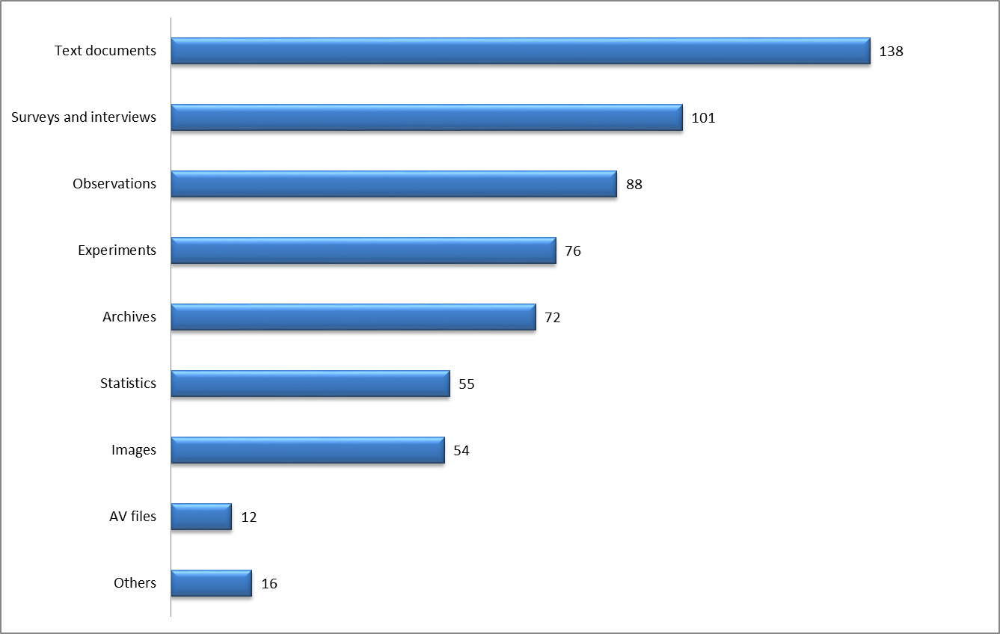
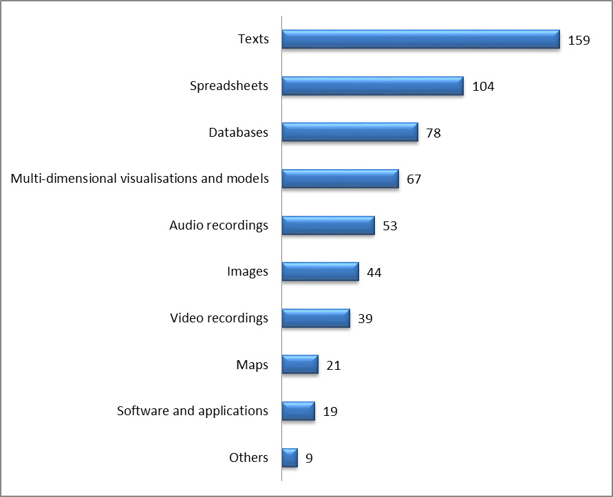
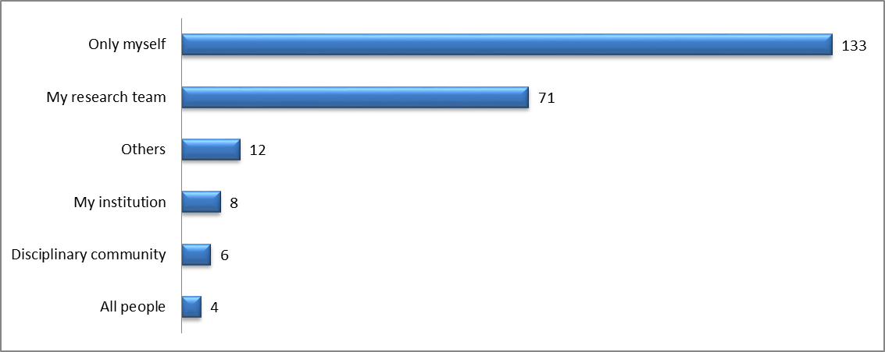
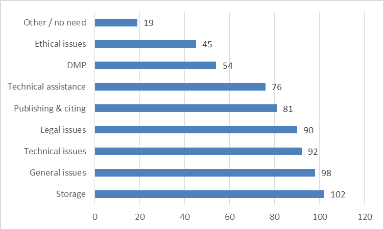
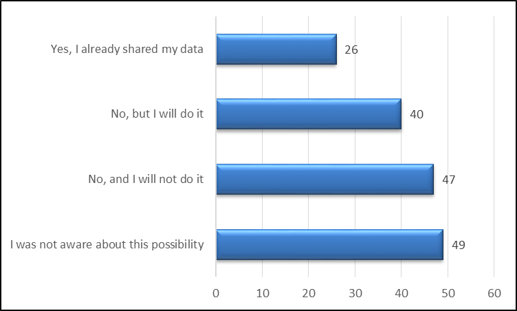
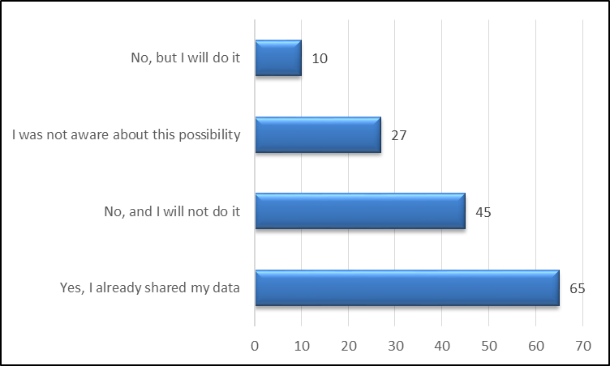
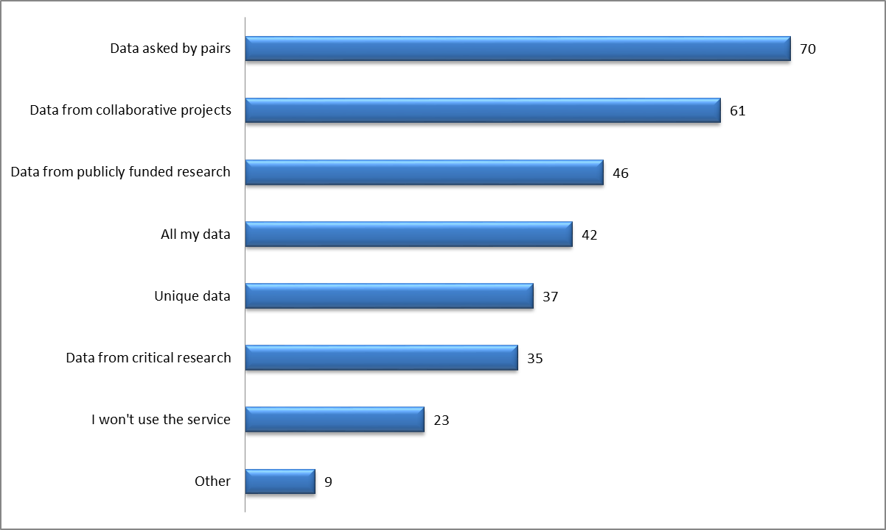
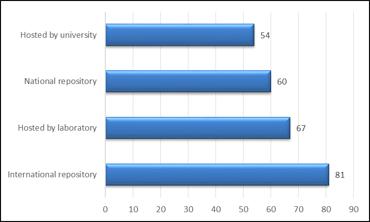

### Introduction

Research data management is a central part of the European Open Science
Agenda in the field of research and innovation. For the European
Commission (EC),

"'Open Science' is the transformation, opening up and democratisation of
science, research and innovation, with the objective of making science
more efficient, transparent and interdisciplinary, of changing the
interaction between science and society, and of enabling broader
societal impact and innovation" (Ramjoué 2015, p.169).

'Open research data' is one of the key components of the emerging new
ecosystem of standards and services, and the EC priorities include
"raising awareness regarding data management, interoperability of
infrastructure and datasets, and re-usability of data" (*ibid*.). In
France, the Conference of University Presidents put the issue of
research data preservation and sharing at the top of their priorities
during their annual conference in 2015, the Ministry of Higher Education
and Research supports and promotes related actions, and all major public
research organizations such as the CNRS (*Centre national de la
recherche scientifique)* contribute to the development of data
infrastructures and repositories.

The main issues and objectives are the same as in Germany or other
countries, i.e. long-term preservation of scientific output and a global
policy of open data in order to increase transparency and stimulate
research, innovation and economic activity. There is a general consensus
about the complexity and the diversity of the field. Not only are
research data difficult to define but their handling and processing
largely depends on institutional and disciplinary practices and
behaviours; obviously, the term research data

"must always be viewed in relation to a particular subject discipline
(…) all requirements for the management and long-term availability of
research data must be differentiated from each other in regard to both
general and discipline-specific aspects and solutions (and) thus far,
there is no general agreement on the definition of digital curation, not
only in Germany, but on international levels as well" (Neuroth et al.
2013, p.11);

one size does not fit all. Also, organizational or national policies and
projects (top-down) require support and back-up from the scientific
communities and local structures (bottom-up) to meet the scientists’
needs with success.

"To support the step-by-step development of sound research data
management practices, you must first understand researchers’ needs and
perspectives" (Ward et al. 2011, p.265). At Lille, we started in 2013 to
work in the field of research data management, in particular on the
social sciences and humanities campus (Lille 3) with 19,000 students,
580 PhD students, 850 academic and 600 technical staff, in order to
gather empirical evidence for the development of data literacy programs
and new library-based data services and to raise awareness among
scholars and PhD students. This research is conducted together with the
GERiiCO laboratory (information, communication and cultural studies),
the graduate school and the academic library, with the support of the
University’s research department. The following study is work in
progress. We present the results of a campus-wide survey on data
practices and needs in 2015 and compare them with other studies,
including those from Humboldt-Universität zu Berlin (Simukovic et al.
2013, 2014). The complete results have already been published on our
institutional repository HAL-Lille 3 (Prost & Schöpfel 2015). The
further reading section contains other papers on our research work.

### Methodology

The campus-wide survey was conducted in April and May 2015 (five weeks).
The questionnaire contained 22 questions adapted from the survey from
Humboldt-Universität zu Berlin mentioned above, comprising six sections:
information about the respondent, data typology (sources and results),
preservation and backup behaviour, sharing behaviour, opinion and
motivation regarding data sharing and data repositories, data-related
needs. The questionnaire (in French) was communicated to the whole
research community on the social sciences and humanities campus (1,800
persons) in the form of an anonymous online version on a local
LimeSurvey server. The data analysis and interpretation was done between
June and August 2015, and the data were compared to other results from
Berlin (Simukovic et al. 2013, 2014), Strasbourg (Rege 2015, Rebouillat
2015), Iowa (Averkamp et al. 2014), LIBER (Reilly et al. 2011), the
European Commission (Kuipers & van der Hoeven 2009, see also Herb 2015)
and Austria (Bauer et al. 2015).

### Results

#### Response rate

The survey received 270 responses, equivalent to 15% of the whole sample
of scientists, scholars, PhD students, administrative and technical
staff (research management, technical support services). All scientific
departments and research laboratories are represented. Larger and
representative sub-samples are from psychology, history, education,
information and communication sciences.

Also, all professional groups took part in the survey. The largest group
of sub-samples are PhD students (n=73) and senior lecturers (n=69),
followed by professors (n=40), scientists (n=16) and other staff (n=13).
But the most representative group are professors (26%), followed by
senior lecturers (17%) and PhD students (13%).

All respondents were asked to answer to the whole list of 22 questions
but no question was obligatory. Multiple answers were allowed for most
questions. As a result, no question received 100% answers, and the
response rate per question varies between 12% and 82%.

#### Current research data management

One part of the questions was about research data behaviour – which kind
of data are used and produced, how they are stored, preserved,
safeguarded; and how they are shared with other researchers. The
responses show a wide variety of practice and usage.

#### Data sources

The survey identified text documents as the most important data source,
followed by observations, interviews and survey data (figure 1).

<!-- Figure 1: Research data sources (n=214)-->

Other, less important data sources are experiments, archival material,
statistics, images, and audio and video recordings, while log files or
simulations are missing, at least in our sample.

#### Data types

Figure 2 shows the research data produced by the respondents. Again,
text documents are the most important output type, followed by
spreadsheets, databases, multi-dimensional visualisations and models.

<!-- Figure 2: Research data types (n=211) -->

Other data types like audio and video recordings, images, maps or
software are less important.

#### Data storage

Most of the respondents prefer local solutions for the storage of their
research data, either the hard disk of their private personal computer
(83%), or their professional work-station (49%) (figure 3).

<!-- Figure 3: Storage places (n=212) -->

Only 12% store their data on a campus-based server. 19% conserve their
data in the cloud, on a distant server (gratis or not), and 8% store
them on another institution’s server, probably in collaborative,
multi-site research projects.

55% say that they store their data in two or more different places,
which means usually on the personal (private) computer and on the
work-station on the campus. 76% say that they also make use of other
devices, most often external hard drives (61%) and USB flash drives
(46%) while other devices such as CD or DVD are mentioned by few.

How much memory space do they occupy? 38% of the respondents do not know
exactly. 51% estimate their storage size at up to 100 gigabytes while
only 13 respondents (half of them are psychologists) mentioned 1
terabytes or more. While 28% state that they back up the data on a daily
schedule, nearly as many (26%) do it on an irregular basis, "each time
when needed" or "from time to time". Nearly all of them (97%) say that
they are the only people in charge of the preservation of their research
data and that there is no "data officer" or at least another person
specifically designated to perform this task.

Taken together and as a whole, these responses appear to reflect a more
or less individual data behaviour, private rather than professional,
with available, often private (and cheap) devices but caring for
security and backup. We cannot say if the respondents already faced
serious problems with their research data (loss of data, security breach
etc.); probably they never have because they do not seem really
unsatisfied with this situation.

#### Data sharing

Most respondents (64%) do not share their research data with colleagues
or other people (figure 4). Nobody, except themselves, have access to
their data files.

<!-- > Figure 4: Access to research data (n=209) -->

Only 34% share data with their colleagues and/or members of their
research team, and only 5% share them with a wider audience, in an open
data approach *stricto senso*.

Few replied to the question about the reuse of data produced by other
researchers (58%), and even fewer (38%, i.e. 22% of the whole sample)
said that they had already downloaded this kind of scientific output and
8% added that they will try in the future. Also, very few answered that
they were not interested or motivated to reuse other researchers’ data.
One third (38%) simply were (are) not aware of this opportunity and way
of doing science.

#### Needs

Which kind of service and/or support or advice would they like to have?
The questionnaire proposed nine different types of data-related service,
from legal advice to technical infrastructure. Only 5% of the
respondents state that they did not need any service. Most of the other
respondents indicated two or more needs (figure 5).

<!-- Figure 5: Support and services needed (n=188)-->

The survey does not really identify one or two priorities. The answers
rather reflect a set of needs, some more important (storage space,
general advice for data management), others a little bit less (technical
and legal issues, publishing and citing). One third mentioned ethical
issues and help for the preparation of data management plans (DMP).

#### Open access

We also tried to measure the colleagues’ general willingness to deposit
and share their data. Are they motivated? Which kind of data would they
deposit? Would they publish their data along with articles? Which data
repository would they prefer?

About 40% of the respondents express a positive opinion about data
sharing. Either they have already deposited their data in a repository
(16%) or they intend to do so in the future (25%). 30% admit that they
were not aware of this possibility (figure 6).

<!--  Figure 6: Deposit of research data in a data repository (n=162) -->

Another third (29%) clearly say that they never deposited their research
data in the past and that they have no intention of doing so in the
future. A deposit in a data repository is no option for five reasons:
sensitive and confidential data, risk of plagiarism, workload, data
illegibility ("nobody would understand my raw data") and intellectual
property ("these are MY data").

This rejection of data sharing significantly decreases when it comes to
the question of publishing data along with an article, i.e. when data
sharing is incentive or obligatory (figure 7). Here, only 7% declare
that they never shared their data in the past and that they will not
share them in the future.

<!-- Figure 7: Data publishing (n=147) -->

44% of the respondents state that they have already published data
together with an article, and 31% announce that they intend to do so in
the future while 18% admit that they simply did not know about this
possibility.

We also asked when and which kind of data they would share. Again, only
12% clearly state that they will not deposit or share their research
results in this way (figure 8).

<!-- Figure 8: Data deposit (n=187)-->

37% underline that they would share those data asked for by their peers
while others say that they would deposit data produced in collaborative
research projects (33%) or with public funding (25%). The last question
was about the kind of repository they would prefer for the deposit and
sharing of their research data (figure 9). Even without a clear
preference (many respondents mark more than one answer), we can identify
a ranking of preferred options.

<!-- > Figure 9: Preferred data repository (n=173) -->

International data repositories (47%) are at the top of the ranking,
followed by local servers hosted by the laboratory, i.e. the research
institute (39%). National (35%) or campus-wide platforms (31%) are less
preferred. In other words, this sample is more interested in impact and
visibility (international repository) and disciplinary specificity
(laboratory) than in a multidisciplinary, national or institutional
solution. Yet, no alternative is really rejected, and the differences do
not seem to be very significant.

### Discussion

The response rate of this study – 15% - is globally satisfying, compared
with other surveys in the same field where the rate is partially unknown
(Tenopir et al. 2011 and 2015, Averkamp et al. 2014) or varying from 7%
(Rege 2015) and 9% (Bauer et al. 2015) to 24% (Simukovic et al. 2013 and
2014). We received more answers from PhD students (33%) than in other
surveys[^1]. However, the rather small sample of 270 respondents should
induce caution, especially when comparing sub-samples. Therefore, the
following discussion will report tendencies rather than representative
and reliable results.

Another reason for a prudent interpretation is the response rate per
question. While questions about data management received an average
response rate of 78%, the response rate for questions about data sharing
fell to 49%. This low response rate may reflect a lack in a mix of
experience, knowledge, motivation and awareness. But in all cases, it
reduces still further the reliability of the replies.

As a whole, our sample does not confirm the 60-40 rule from the European
PARSE.insight project which states that "60% like to get data from
others but 40% have problems to give their own" (Reilly et al. 2011,
p.12). In the Lille survey, only 46% (and not 60%) like to get data from
others, and only 29% have problems giving their own away, with 30%
others who have not made up their minds so far, for lack of information
and/or awareness. On the whole, the scientists, scholars and PhD
students seem rather pragmatic and realistic on a social sciences,
humanities and arts campus with an extensive education program and a
rather low budget for research.

#### Status and discipline

To most of the survey questions, the professors, senior lecturers and
PhD students replied in a consistent and comparable way, without any
significant differences. The survey confirms that PhD students have less
experience with research data management and sharing and are less aware
of data-related aspects. But they also show a higher motivation to
deposit and share their data in the future (63%) than professors and
senior lecturers who seem more reluctant to deposit (45%). Professors
are also twice more reluctant (28%) than PhD students (13%) to reuse the
research data produced by other scientists. But all agree that they
would prefer international data repositories to local solutions.

Our survey also reveals some differences between scientific communities
(disciplines) on the campus. For instance, scholars in psychology and
education seem less aware of data management and sharing than those in
history, information sciences and modern languages and literature. Yet,
statistically speaking, these are tendencies rather than significant
differences, and as a whole, our sample shows a rather homogeneous
community of scholars and scientists in social sciences and humanities,
at least regarding research data management. Disciplinary differences
exist but they should not be over-interpreted.

#### Clusters

On the whole, we can distinguish four groups in our sample but they are
not related to status or discipline. According to the answers on data
management practice and motivation to share research data, we can
identify four "clusters" of scholars and scientists (in brackets, the
estimated part of the whole sample):

-   The pioneers (20-25%): These respondents have more experience with
    data management and deposit and are more inclined to future data
    sharing than their colleagues.

-   The motivated (25-30%): A second group of scholars and scientists
    with less or no experience are nevertheless highly motivated to
    engage in data sharing in the future.

-   The unaware (30%): About one third of the sample admit that they are
    not really aware of research data management, of the opportunities
    for sharing their results with others or of the possibility to reuse
    the data of other scientists.

-   The reluctant (5-10%): A small group did not deposit or share their
    data up to now and state that they will not do so in the
    future either.

Of course, the boundaries between these clusters are not always evident,
in particular between the "pioneers" and the "motivated". Also, because
of the small size of the sub-samples, we did not try to characterize
these clusters with regards to job status and discipline. More important
for us is (1) the empirical evidence of different groups, a fact that
calls for a differential approach on the campus, and (2) the relative
part of each cluster, in particular the relatively small size of the
"reluctant group".

#### Comparison with other surveys

Compared to the results of other surveys[^2], we can highlight three
aspects:

-   Data management: less experience and a more personal (private)
    practice, especially regarding the way data are stored and
    backed up. At the University of Iowa, 69% store their data on their
    private computers but 72% (also) on a shared drive or
    institutional server. Austrian scientists mainly use their work
    computers (71%) and external storage devices (64%), while only 54%
    store the data on their private computers.

-   Data sharing: a lower percentage of respondents already share data
    (34%), compared to the Berlin (50%), LIBER (58%) or NSF
    follow-up (75%) surveys. The Austrian scientists reported that they
    grant access to their data on request (57%) or to members of their
    own institution (53%). However, only 28% made their data available
    to the scientific community and only 10% to a wider public. These
    figures are more in line with our own results, such as the first NSF
    survey where only 36% scientists stated that they made their data
    easily accessible (Tenopir et al. 2011).

-   Attitude towards data sharing: less favourable (40%) than the Berlin
    survey (60%), yet not more reluctant (12% compared to 15% in Berlin
    or 10% in Austria). The first NSF survey revealed that nearly half
    of the respondents would not share their data with others (46%) but
    the follow-up study shows that this percentage is decreasing.

One reason for these differences may be the fact that the Lille 3 survey
puts the focus on social sciences and humanities. Other aspects are
consistent with the cited surveys, such as the mainly personal
responsibility for data management (93% "myself" in the Austria survey)
and the preference for international and decentralized institutional
data repositories (47% and 37%, Austria survey). The NSF follow-up study
confirmed that scientists in psychology and education are in average
less interested in data sharing, probably because of the often
non-anonymous character of their results.

### Conclusion

The Lille survey provides a photography of a dynamic situation. Tenopir
et al. (2015) described this situation as a "complex shift, with varying
cultures among scientists that dictate the norms surrounding data
sharing and reuse (and) still perceived risks and barriers that may be
slowing the data sharing movement". However, our study also showed that
the continued barriers affect only a small part of the scientists,
scholars and PhD students and that most of them are not opposed to data
sharing but may need more information about conditions and
opportunities.

The survey results helped us to improve the information about data
management, deposit and sharing and to launch a training program for PhD
students, as part of their doctoral education, as we are convinced that
"the best possible point at which to intervene with guidance and
training is very early on in a researcher’s career" (Ward et al. 2011,
p.268). The survey itself also raised awareness on the issue of data
management and data sharing and on the data policy on the Lille 3
campus[^3]. The next step will be the project of a Lille data
repository, either for all disciplines or limited to social sciences and
humanities, in the framework of the French data infrastructure in
digital humanities[^4]. All these actions (figure 10) are coordinated
and supported by the academic library, the graduate school in social
sciences and humanities, the GERiiCO research laboratory, the
University’s research management and the European Institute for Social
Sciences and Humanities[^5] at Lille.

<!-- Figure 10: Research data support services -->

The academic library plays a central part in particular in education,
advice and assistance. The library will also be partner to a series of
in-depth interviews with a smaller sample of scientists (n=30-50) in
order to learn more about data behaviour, best practices and
data-related needs. And the academic librarians’ contribution is
expected and necessary also for the development of infrastructures and
tools.

### Acknowledgments

The study was supported by the Department of
International Relations of the University of Lille 3 and the European
Institute for Social Sciences and Humanities at Lille. We would like to
thank all colleagues who contributed to the success of the survey, in
particular Peter Schirmbacher, Maxi Kindling and Elena Simukovic
(Berlin), Isabelle Westeel, Cécile Malleret and Stéphane Chaudiron
(Lille).

### References

Averkamp, S., Gu, X., Rogers, B., 2014. *Data management at the
University of Iowa: A university libraries report on campus research
data needs*. University of Iowa.
<http://ir.uiowa.edu/lib_pubs/153/>

Bauer, B., Ferus, A., Gorraiz, J., Gumpenberger, C., Gründhammer, V.,
Maly, N., Mühlegger, J. M., Preza, J. L., Sánchez Solís, B., Schmidt,
N., Steineder, C., 2015. *Researchers and their data. Results of an
Austrian survey - report 2015*. e-infrastructures austria, Vienna.
<http://e-infrastructures.at/das-projekt/deliverables/>

Chaudiron, S., Maignant, C., Schöpfel, J., Westeel, I., 2015. *Livre
blanc sur les données de la recherche dans les thèses de doctorat*.
Université de Lille 3, Villeneuve d'Ascq.
<http://hal.univ-lille3.fr/hal-01192930>

Herb, U., 2015. *Open Science in der Soziologie. Eine interdisziplinäre
Bestandsaufnahme zur offenen Wissenschaft und eine Untersuchung ihrer
Verbreitung in der Soziologie*. vwh Verlag Werner Hülsbusch, Glückstadt.

Kuipers, T., van der Hoeven, J., 2009. *Insight into digital
preservation of research output in Europe. Survey report.* PARSE
insight, European Commission, Brussels.
<http://www.parse-insight.eu/downloads/PARSE-Insight_D3-4_SurveyReport_final_hq.pdf>

Neuroth, H., Strathmann, S., Oßwald, A., Ludwig, J. (Eds.), 2013.
*Digital curation of research data. Experiences of a baseline study in
Germany*. vwh Verlag Werner Hülsbusch, Glückstadt.
<http://www.nestor.sub.uni-goettingen.de/bestandsaufnahme/Digital_Curation.pdf>

Prost, H., Schöpfel, J., 2015. *Les données de la recherche en SHS. Une
enquête à l'Université de Lille 3.* Rapport final. Université de Lille
3, Villeneuve d'Ascq.
<http://hal.univ-lille3.fr/hal-01198379v1>

Ramjoué, C., 2015. Towards Open Science: The vision of the European
Commission. *Information Services & Use 35* (3), 167-170.
<http://doi.org/10.3233/isu-150777>

Rebouillat, V., 2015. *Archives ouvertes de la connaissance : Valoriser
et diffuser les données de recherche*. Master's thesis, ENSSIB,
Villeurbanne.
<http://cataloguebib.enssib.fr/cgi-bin/koha/opac-detail.pl?biblionumber=1903>

Rege, A., 2015. Retour sur l'enquête sur les pratiques de publication
scientifique et de production de données de la recherche. In:
*Université de Strasbourg, Projet AOC*, COPIL 27 mars 2015.

Reilly, S., Schallier, W., Schrimpf, S., Smit, E., Wilkinson, M., 2011.
*Report on integration of data and publications*. ODE Opportunities for
Data Exchange, The Hague.
<http://www.stm-assoc.org/2011_12_5_ODE_Report_On_Integration_of_Data_and_Publications.pdf>

Simukovic, E., Kindling, M., Schirmbacher, P., 2013. *Umfrage zum Umgang
mit digitalen Forschungsdaten an der Humboldt-Universität zu Berlin.*
Report, Humboldt-Universität zu Berlin, Zentraleinrichtung Computer- und
Medienservice (Rechenzentrum), Berlin.
<http://edoc.hu-berlin.de/docviews/abstract.php?id=40341>

Simukovic, E., Kindling, M., Schirmbacher, P., 2014. Unveiling research
data stocks: A case of Humboldt-Universität zu Berlin. In:
*iConference*, 4-7 March 2014, Berlin. pp. 742-748.
<https://www.ideals.illinois.edu/handle/2142/47259>

Tenopir, C., Allard, S., Douglass, K., Aydinoglu, A. U., Wu, L., Read,
E., Manoff, M., Frame, M., 2011. Data sharing by scientists: Practices
and perceptions. *PLoS ONE* 6 (6), e21101+.
<http://doi.org/10.1371/journal.pone.0021101>

Tenopir, C., Dalton, E. D., Allard, S., Frame, M., Pjesivac, I., Birch,
B., Pollock, D., Dorsett, K., 2015. Changes in data sharing and data
reuse practices and perceptions among scientists worldwide. *PLoS ONE*
10 (8), e0134826+.
<http://doi.org/10.1371/journal.pone.0134826>

Ward, C., Freiman, L., Jones, S., Molloy, L., Snow, K., Jul. 2011.
Making sense: Talking data management with researchers. *International
Journal of Digital Curation* 6 (2),
265-273. <http://doi.org/10.2218/ijdc.v6i2.202>

### Further readings

Chaudiron, S., Maignant, C., Schöpfel, J., Westeel, I., 2015. *Livre
blanc sur les données de la recherche dans les thèses de doctorat.*
Université de Lille 3, Villeneuve d'Ascq.
<http://hal.univ-lille3.fr/hal-01192930>

Prost, H., Malleret, C., Schöpfel, J., 2015. Hidden treasures. Opening
data in PhD dissertations in social sciences and humanities. *Journal of
Librarianship and Scholarly Communication* 3 (2), eP1230+.
<http://doi.org/10.7710/2162-3309.1230>

Schöpfel, J., Chaudiron, S., Jacquemin, B., Prost, H., Severo, M.,
Thiault, F., 2014. Open access to research data in electronic theses and
dissertations: An overview. *Library Hi Tech* 32 (4), 612-627.
<http://doi.org/10.1108/LHT-06-2014-0058>

Schöpfel, J., Prost, H., Malleret, C., 2015a. Making data in PhD
dissertations reusable for research. In: *8th Conference on Grey
Literature and Repositories*, National Library of Technology (NTK), 21
October 2015, Prague, Czech Republic.
<http://hal.univ-lille3.fr/hal-01248979/document>

Schöpfel, J., Juznic, P., Prost, H., Malleret, C., Cesarek, A.,
Koler-Povh, T., 2015b. Dissertations and data (keynote address). In:
*GL17 International Conference on Grey Literature*, 1-2 December 2015,
Amsterdam.
<http://hal.univ-lille3.fr/hal-01285304>

[^1]: Berlin 23% (Simukovic et al. 2013), Strasbourg 10% (Rege 2015),
    international NSF survey 13.5% (Tenopir et al. 2011)

[^2]: Berlin n=499 (Simukovic et al. 2013, 2014) ; Strasbourg n=644
    (Rege 2015, Rebouillat 2015) ; LIBER n=1840 (Reilly et al. 2011,
    Kuipers & van der Hoeven 2009, cf. also Herb 2015) ; Iowa n=784
    (Averkamp et al. 2014) ; Austria n=3,026 (Bauer et al. 2015) ;
    international NSF survey n=1,315 (Tenopir et al. 2011) and follow-up
    n=1,015 (Tenopir et al. 2015)

[^3]: For instance, we published a white paper on data in dissertations
    (Chaudiron et al. 2015), we organize an international conference on
    electronic dissertations and research data (ETD2016) and we develop
    our library based service on research data, also in collaboration
    with the UK JISC.

[^4]: <http://www.huma-num.fr/>

[^5]: <http://www.meshs.fr/>
